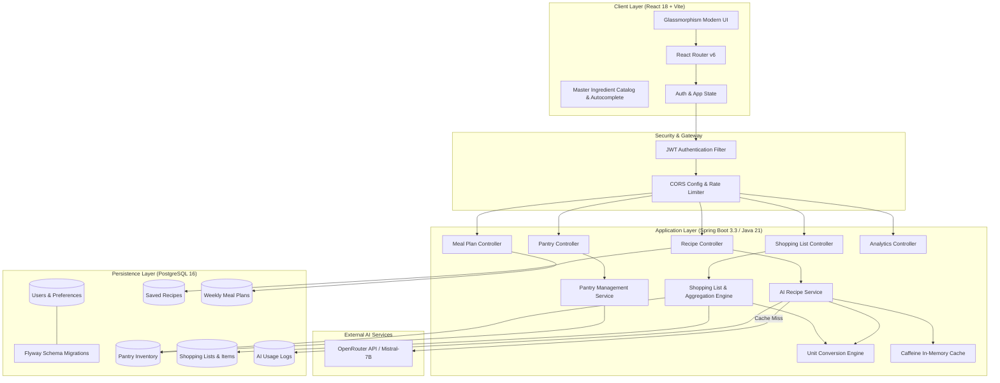
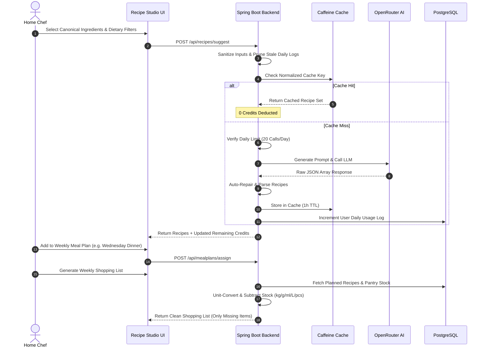

# 🍳 MealCraft — Enterprise AI Recipe & Smart Meal Planning Platform

[](https://spring.io/projects/spring-boot)
[](https://openjdk.org/)
[](https://reactjs.org/)
[](https://vitejs.dev/)
[](https://www.postgresql.org/)
[](https://junit.org/junit5/)
[](https://www.docker.com/)

**MealCraft** is an intelligent, full-stack culinary platform that transforms pantry ingredients into personalized chef recipes, automates 7-day nutritional meal planning, and generates precise, unit-converted grocery shopping lists.

---

## 🏛️ System Architecture



---

## 🔄 End-to-End Workflow



---

## 🚀 Key Improvements & Engineering Rationale

### 1. Master Ingredient Catalog & Autocomplete
* **What was built**: A curated database of 130+ standard ingredients across 8 culinary categories with synonyms, default units, and emoji tags.
* **Why**: Free-text entry led to spelling errors (`"tomatos"` vs `"tomato"`), pluralization mismatches (`"eggs"` vs `"egg"`), and regional alias mismatches (`"cilantro"` vs `"coriander"`). Standardizing names ensures 100% deterministic inventory matching.

### 2. Base-Unit Conversion & Partial Pantry Subtraction
* **What was built**: A unified `UnitConverter` engine supporting Weight (`kg`, `g`, `oz`, `lbs`), Volume (`L`, `ml`, `cups`, `tbsp`, `tsp`), and Discrete Counts (`pcs`, `cloves`, `slices`, `cans`).
* **Why**: Previously, the shopping list engine used naive string subtraction (`aggregated.keySet().removeAll(pantryNames)`). If a user had $200\text{g}$ flour in pantry and needed $500\text{g}$, the old code subtracted it entirely. The new system converts both to base units and precisely adds only the missing $300\text{g}$ to the shopping list.

### 3. Real-Time AI Quota Tracking & Daily Log Auto-Pruning
* **What was built**:
  * Direct cache-hit verification so cached queries consume **zero** user credits.
  * Real-time `/api/recipes/ai-credits` endpoint so the UI displays current quota immediately on load.
  * Daily pruning query (`DELETE FROM ai_usage_log WHERE usage_date < :today`) ensuring users start fresh every morning without stale records.
* **Why**: Prevents user frustration from stale counters and eliminates rate-limit bypasses while protecting API costs.

### 4. Content-First Culinary Cards (Photo-Free)
* **What was built**: Transformed recipe cards into clean, typography-focused culinary dashboards showcasing preparation metrics, calories, cuisine badges, and match percentages.
* **Why**: Third-party placeholder photos caused slow page loads, layout shifts, and inconsistent visual themes. The modern typography-first layout provides immediate scannability and near-instant render times.

### 5. Robust 34-Test JUnit 5 Suite
* **What was built**: Comprehensive unit test suite covering `UnitConverterTest`, `RecipeResponseParserTest`, `ShoppingListServiceTest`, `PantryServiceTest`, and `AIRecipeServiceTest`.
* **Why**: Guarantees rock-solid reliability across mathematical conversions, LLM JSON auto-repair, pantry deduplication, and rate-limiting rules.

---

## 📦 Tech Stack

### Backend
* **Runtime**: Java 21 (OpenJDK / Eclipse Temurin)
* **Framework**: Spring Boot 3.3.2 (Web, Data JPA, Security, Validation, Cache)
* **Database**: PostgreSQL 16 with Flyway versioned migrations
* **Security**: Stateless JWT Authentication (`io.jsonwebtoken 0.12.6`) with BCrypt hashing
* **Caching**: Caffeine High-Performance In-Memory Cache
* **Testing**: JUnit 5, Mockito, AssertJ

### Frontend
* **Core**: React 18, Vite 8.2 (ESModules)
* **Routing**: React Router v6
* **UI & Aesthetics**: Custom Glassmorphism Design System (Vanilla CSS with CSS Variables)
* **Icons & Notifications**: Lucide React, React Hot Toast

---

## 🛠️ Local Setup & Installation

### Prerequisites
* **Java 21+** (`java -version`)
* **Maven 3.9+** (`mvn -version`)
* **Node.js 18+ & npm** (`node -v`)
* **PostgreSQL 14+** running locally or via Docker

---

### Step 1: Database Setup
```sql
CREATE DATABASE mealplanner;
```

---

### Step 2: Configure Environment Variables

#### Backend Configuration
Edit `backend/src/main/resources/application.properties` (or pass via environment):
```properties
spring.datasource.url=jdbc:postgresql://localhost:5432/mealplanner
spring.datasource.username=postgres
spring.datasource.password=your_postgres_password

openrouter.api.key=your_openrouter_api_key
jwt.secret=your_256_bit_secure_random_jwt_secret_key
ai.rate-limit.calls-per-day=20
```

#### Frontend Configuration
Create `frontend/.env.development`:
```env
VITE_API_BASE_URL=http://localhost:8080/api
```

---

### Step 3: Run the Backend
```bash
cd backend
mvn clean spring-boot:run
```
* Flyway will automatically apply all schema migrations.
* Backend starts at `http://localhost:8080`.

---

### Step 4: Run the Frontend
```bash
cd frontend
npm install
npm run dev
```
* Frontend starts at `http://localhost:5173`.

---

## 🐳 Docker Deployment

To build and run the backend using Docker:

```bash
cd backend
docker build -t mealcraft-backend:latest .
docker run -p 8080:8080 \
  -e SPRING_DATASOURCE_URL="jdbc:postgresql://host.docker.internal:5432/mealplanner" \
  -e SPRING_DATASOURCE_USERNAME="postgres" \
  -e SPRING_DATASOURCE_PASSWORD="password" \
  -e OPENROUTER_API_KEY="your_key" \
  -e JWT_SECRET="your_secret" \
  mealcraft-backend:latest
```

---

## 🧪 Running Tests

Execute the full test suite with Maven:
```bash
cd backend
mvn test
```

### Test Results Breakdown:
```text
[INFO] Running com.mealplanner.ai.RecipeResponseParserTest     --> 5 passed
[INFO] Running com.mealplanner.service.AIRecipeServiceTest    --> 4 passed
[INFO] Running com.mealplanner.service.PantryServiceTest       --> 3 passed
[INFO] Running com.mealplanner.service.ShoppingListServiceTest --> 2 passed
[INFO] Running com.mealplanner.util.UnitConverterTest         --> 20 passed
[INFO] Results: Tests run: 34, Failures: 0, Errors: 0, Skipped: 0
[INFO] BUILD SUCCESS
```

---

## 📡 REST API Reference

### 🔐 Authentication
| Method | Endpoint | Description | Auth Required |
| :--- | :--- | :--- | :---: |
| `POST` | `/api/auth/register` | Register new user | No |
| `POST` | `/api/auth/login` | Authenticate & obtain JWT | No |

### 🤖 AI Recipe Studio
| Method | Endpoint | Description | Auth Required |
| :--- | :--- | :--- | :---: |
| `POST` | `/api/recipes/suggest` | Generate recipes from ingredients | Yes |
| `GET` | `/api/recipes/ai-credits` | Get remaining daily AI quota | Yes |
| `GET` | `/api/recipes` | List saved recipes (supports search/filter) | Yes |
| `POST` | `/api/recipes` | Save recipe to user cookbook | Yes |
| `DELETE`| `/api/recipes/{id}` | Delete recipe | Yes |

### 🧺 Pantry & Inventory
| Method | Endpoint | Description | Auth Required |
| :--- | :--- | :--- | :---: |
| `GET` | `/api/pantry` | Get all stocked pantry items | Yes |
| `POST` | `/api/pantry` | Add or update (upsert) pantry item | Yes |
| `DELETE`| `/api/pantry/{id}` | Remove item from pantry | Yes |
| `DELETE`| `/api/pantry` | Clear entire pantry | Yes |

### 🗓️ Weekly Meal Planner
| Method | Endpoint | Description | Auth Required |
| :--- | :--- | :--- | :---: |
| `GET` | `/api/mealplans/{weekStart}` | Get 7-day meal plan for week | Yes |
| `POST` | `/api/mealplans/{weekStart}/assign` | Assign recipe to meal slot | Yes |
| `DELETE`| `/api/mealplans/{weekStart}/entry/{id}`| Remove meal from plan | Yes |

### 🛒 Smart Shopping List
| Method | Endpoint | Description | Auth Required |
| :--- | :--- | :--- | :---: |
| `POST` | `/api/shopping-list/generate/{planId}`| Build unit-subtracted list from plan | Yes |
| `GET` | `/api/shopping-list/{id}` | Get shopping list by ID | Yes |
| `PATCH`| `/api/shopping-list/item/{id}/toggle` | Check/uncheck shopping item | Yes |
| `POST` | `/api/shopping-list/{id}/manual` | Add custom item to list | Yes |

### 📊 Kitchen Analytics
| Method | Endpoint | Description | Auth Required |
| :--- | :--- | :--- | :---: |
| `GET` | `/api/analytics` | Get cooking stats, top cuisines, calories | Yes |
| `POST` | `/api/analytics/cooked` | Log recipe as cooked | Yes |

---

## 🔒 Security Best Practices

1. **API Key Isolation**: LLM credentials (`OPENROUTER_API_KEY`) remain strictly on the backend.
2. **Server-Side Input Sanitization**: All ingredient strings are validated and bounded (max 50 ingredients, max 100 characters per item) before reaching the AI parser.
3. **Stateless JWT**: Cryptographically signed tokens with expiration and authorization interceptors.
4. **Data Privacy**: All database queries strictly enforce `user_id` ownership isolation across all CRUD operations.

---

## 📄 License
This project is licensed under the MIT License — feel free to use and customize for your culinary adventures!
