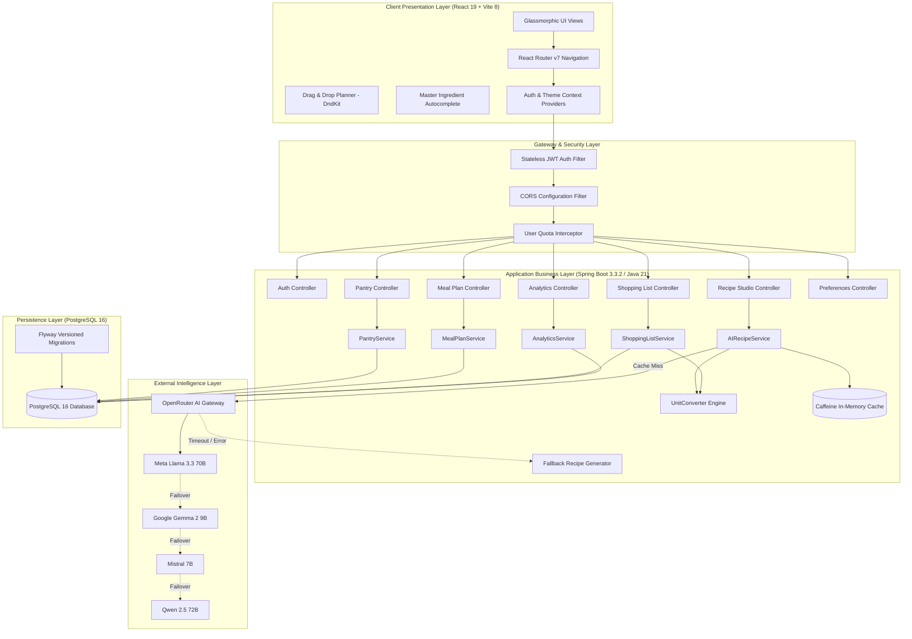
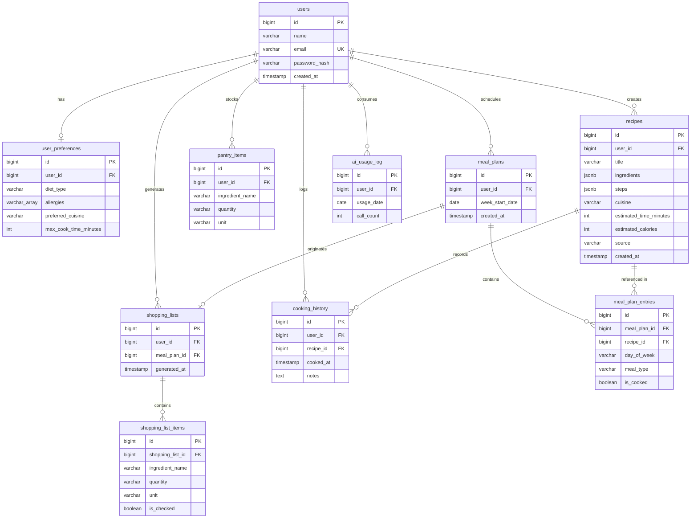

<div align="center">

# 🍳 MealCraft

### Intelligent Recipe Generation, 7-Day Meal Planning & Precision Grocery Logistics

*A production-grade, full-stack culinary operating system engineered with Java 21, Spring Boot 3.3, React 19, and PostgreSQL 16.*

---

[](https://spring.io/projects/spring-boot)
[](https://openjdk.org/)
[](https://react.dev/)
[](https://vitejs.dev/)
[](https://www.postgresql.org/)
[](https://flywaydb.org/)
[](https://junit.org/junit5/)
[](https://www.docker.com/)
[](https://opensource.org/licenses/MIT)

<p align="center">
  <a href="#-executive-summary">Executive Summary</a> •
  <a href="#-the-problem-vs-the-solution">Why MealCraft</a> •
  <a href="#-core-capabilities">Core Capabilities</a> •
  <a href="#-system-architecture">Architecture</a> •
  <a href="#-end-to-end-workflow">Workflow</a> •
  <a href="#-engineering-deep-dives">Deep Dives</a> •
  <a href="#-database-schema--entity-relationships">Database Schema</a> •
  <a href="#-rest-api-specification">API Reference</a> •
  <a href="#-quick-start--local-setup">Quick Start</a> •
  <a href="#-docker--docker-compose-deployment">Docker</a> •
  <a href="#-testing--quality-assurance">Testing</a> •
  <a href="#-troubleshooting--faq">Troubleshooting</a>
</p>

</div>

---

## 📌 Executive Summary

**MealCraft** is an intelligent, full-stack culinary platform that bridges the gap between disorganized home pantries, nutritional meal preparation, and grocery logistics. By synthesizing **multi-model generative artificial intelligence**, **deterministic unit conversion mathematics**, and **modern glassmorphic interface design**, MealCraft empowers home cooks to:

1. **Transform Scattered Pantry Stock into Chef-Grade Recipes** without hallucinated ingredients or unstocked staples.
2. **Automate 7-Day Meal Scheduling** across Breakfast, Lunch, Dinner, and Snack slots using an interactive drag-and-drop interface.
3. **Consolidate Smart Shopping Lists** that calculate exact net mathematical shortages ($500\text{g} \text{ needed} - 200\text{g} \text{ in pantry} = 300\text{g} \text{ to buy}$) instead of naive string matching.
4. **Eliminate Operational AI Costs** through normalized key caching (0 credits consumed on cache hits) and multi-model fallback resiliency.

---

## ⚖️ The Problem vs. The Solution

| Challenge in Traditional Meal Apps | The MealCraft Solution |
| :--- | :--- |
| **Pantry Ingredients Ignored**: Apps suggest recipes requiring 15 new groceries without factoring in what already exists in your kitchen. | **Deterministic Inventory Matching**: AI generates recipes tailored strictly around existing pantry staples, isolating only true missing items. |
| **Naive Grocery Subtraction**: If a recipe needs 500g flour and you have 200g, traditional apps drop flour entirely or add another 500g. | **Base-Unit Mathematical Subtraction**: Converts all measurements (weight, volume, counts) to base metric units and computes the precise net difference. |
| **High Latency & Fragile AI**: Upstream LLM rate limits or timeouts cause recipe generation to crash with generic 500 errors. | **Cascaded Multi-Model Fallback & Offline Engine**: Automatically rotates across 4 open LLMs (`Llama 3.3`, `Gemma 2`, `Mistral`, `Qwen 2.5`) with instant local heuristic fallback. |
| **Unpredictable AI Quotas**: Repetitive queries drain user credits rapidly. | **Zero-Credit Normalized Caching**: Identical or permuted pantry sets (`[Chicken, Rice]` vs `[Rice, Chicken]`) are served instantly from Caffeine cache at 0 credit cost. |
| **Sluggish UI with Heavy Photo CDNs**: Bloated third-party recipe images trigger layout shifts, slow renders, and broken image links. | **Content-First Culinary Dashboards**: Ultra-fast, typography-focused glassmorphism UI displaying macronutrient breakdowns, preparation time, and match ratios. |

---

## 🚀 Core Capabilities

### 1. 🤖 Intelligent Multi-Model AI Recipe Studio
* **Dynamic Multi-LLM Cascading**: Communicates via OpenRouter with auto-failover across leading models:
  * Primary: `meta-llama/llama-3.3-70b-instruct:free`
  * Secondary: `google/gemma-2-9b-it:free`
  * Tertiary: `mistralai/mistral-7b-instruct:free`
  * Quaternary: `qwen/qwen-2.5-72b-instruct:free`
* **Deterministic Fallback Engine (`FallbackRecipeGenerator`)**: Guarantees high availability. If all external AI providers time out or encounter rate limits, an internal culinary logic engine synthesizes curated, balanced recipes immediately.
* **AST JSON Auto-Repair (`RecipeResponseParser`)**: Robust parser strips markdown fences, balances truncated JSON structures, and sanitizes ingredient strings before persisting.
* **Daily Quota & Auto-Pruning**: Users receive 20 daily AI generations. A scheduled pruning query deletes stale records at midnight, providing a fresh quota every day.

### 2. ⚖️ Base-Unit Conversion & Net-Shortage Arithmetic
* **Full Unit Conversion Hierarchy**:
  * **Weight**: Grams ($g$), Kilograms ($kg$), Ounces ($oz$), Pounds ($lb$).
  * **Volume**: Milliliters ($ml$), Liters ($l$), Cups ($240ml$), Tablespoons ($15ml$), Teaspoons ($5ml$).
  * **Discrete Counts**: Pieces, Cloves, Slices, Cans, Bunches, Pinches, Heads, Stalks, Sprigs.
* **Culinary Synonym Mapping**: Resolves 25+ common culinary aliases (`cilantro` $\rightarrow$ `coriander`, `capsicum` $\rightarrow$ `bell pepper`, `scallion` $\rightarrow$ `green onion`, `maida` $\rightarrow$ `all-purpose flour`).
* **Plural Stripping & Normalization**: Strips suffixes (`tomatoes` $\rightarrow$ `tomato`, `eggs` $\rightarrow$ `egg`) ensuring 100% deterministic inventory subtraction.

### 3. 🗓️ Interactive 7-Day Drag-and-Drop Meal Planner
* **Weekly Visual Board**: Plan meals across all 7 days for **Breakfast**, **Lunch**, **Dinner**, and **Snack**.
* **Accessible Drag-and-Drop**: Built with `@dnd-kit/core` and `@dnd-kit/sortable` for fluid touch and desktop card reordering.
* **Cooked State Tracking**: Check off meals as cooked to record nutrition, calculate weekly adherence rate, and auto-sync cooking history logs.
* **One-Click Shopping List Sync**: Aggregates all ingredients required for the scheduled week and computes the net shortage against your current pantry.

### 4. 🧺 Canonical Master Ingredient Catalog
* **130+ Standardized Ingredients**: Curated database categorized into 8 culinary groups (Produce, Meat & Seafood, Dairy & Refrigerated, Pantry & Baking, Spices & Seasonings, Grains & Pasta, Canned Goods, Condiments & Oils).
* **Fuzzy Autocomplete**: Prevents typographical variations during pantry entry and recipe prompting.

### 5. 📊 Kitchen Analytics & Nutritional Telemetry
* **Weekly Calorie & Time Totals**: Visual distribution of planned vs. cooked calories, prep time per day, and busiest cooking days.
* **Cuisine Diversity Metrics**: Tracks top cuisine preferences and adherence over time.
* **Personal Cooking Journal**: Allows users to log personal chef notes and ratings upon completing recipes.

### 6. 🎨 Glassmorphic Interface & Design System
* **Dual Theme Architecture**: Built from scratch using CSS custom properties with dedicated high-contrast Dark and Light modes.
* **Responsive Layouts**: Desktop sidebar with auto-collapsing mobile drawer and thumb-friendly bottom navigation bar.
* **Zero Layout Shift**: Avoids heavy third-party photos in favor of instant-loading culinary metric cards.

---

## 🏛️ System Architecture


```mermaid
flowchart TB
    subgraph Client ["Client Presentation Layer (React 19 + Vite 8)"]
        UI[Glassmorphic UI Views]
        Router[React Router v7 Navigation]
        DnD[Drag & Drop Planner - DndKit]
        Catalog[Master Ingredient Autocomplete]
        AuthContext[Auth & Theme Context Providers]
    end

    subgraph Security ["Gateway & Security Layer"]
        CORS[CORS Configuration Filter]
        JWT[Stateless JWT Auth Filter]
        RateLimiter[User Quota Interceptor]
    end

    subgraph Backend ["Application Business Layer (Spring Boot 3.3.2 / Java 21)"]
        AuthController[Auth Controller]
        RecipeController[Recipe Studio Controller]
        PantryController[Pantry Controller]
        MealPlanController[Meal Plan Controller]
        ShoppingController[Shopping List Controller]
        AnalyticsController[Analytics Controller]
        PrefController[Preferences Controller]

        AIService[AIRecipeService]
        UnitConv[UnitConverter Engine]
        ShoppingService[ShoppingListService]
        PantryService[PantryService]
        MealPlanService[MealPlanService]
        AnalyticsService[AnalyticsService]

        Cache[(Caffeine In-Memory Cache)]
        FallbackGen[Fallback Recipe Generator]
    end

    subgraph External ["External Intelligence Layer"]
        OpenRouter[OpenRouter AI Gateway]
        LLM1[Meta Llama 3.3 70B]
        LLM2[Google Gemma 2 9B]
        LLM3[Mistral 7B]
        LLM4[Qwen 2.5 72B]
    end

    subgraph Database ["Persistence Layer (PostgreSQL 16)"]
        Flyway[Flyway Versioned Migrations]
        PG[(PostgreSQL 16 Database)]
    end

    UI --> Router --> AuthContext
    AuthContext --> JWT --> CORS --> RateLimiter
    RateLimiter --> AuthController & RecipeController & PantryController & MealPlanController & ShoppingController & AnalyticsController & PrefController

    RecipeController --> AIService
    AIService --> Cache
    AIService -- Cache Miss --> OpenRouter
    OpenRouter --> LLM1 -. Failover .-> LLM2 -. Failover .-> LLM3 -. Failover .-> LLM4
    OpenRouter -. Timeout / Error .-> FallbackGen
    AIService --> UnitConv

    PantryController --> PantryService --> PG
    MealPlanController --> MealPlanService --> PG
    ShoppingController --> ShoppingService
    ShoppingService --> UnitConv
    ShoppingService --> PG
    AnalyticsController --> AnalyticsService --> PG

    Flyway --> PG
```

---

## 🔄 End-to-End Workflow


```mermaid
sequenceDiagram
    autonumber
    actor Chef as Home Chef
    participant UI as MealCraft Client
    participant Auth as Security Filter
    participant API as Spring Boot API
    participant Cache as Caffeine Cache
    participant AI as OpenRouter AI
    participant DB as PostgreSQL 16

    Chef->>UI: Selects pantry items & clicks "Suggest Recipes"
    UI->>Auth: POST /api/recipes/suggest (Bearer JWT)
    Auth->>API: Validates token & extracts user identity
    API->>API: Normalize ingredients & generate cache key
    API->>Cache: Lookup cached recipe payload

    alt Cache Hit (Normalized Key Match)
        Cache-->>API: Return cached recipes
        Note over API: 0 User Credits Deducted
    else Cache Miss
        API->>DB: Verify daily limit (<= 20 requests/day)
        API->>AI: Dispatch prompt across cascading models
        alt Primary Model Available
            AI-->>API: Return raw JSON recipe array
        else Upstream Failure / Timeout
            API->>API: Trigger FallbackRecipeGenerator (Local Heuristic)
        end
        API->>API: Auto-repair, balance JSON & validate
        API->>Cache: Save payload (1-Hour TTL)
        API->>DB: Increment user's daily usage log
    end

    API-->>UI: Return recipes + remaining credits
    Chef->>UI: Save recipe & assign to Wednesday Dinner
    UI->>API: POST /api/mealplans/{weekStart}/assign
    API->>DB: Store meal plan entry slot

    Chef->>UI: Click "Generate Smart Shopping List"
    UI->>API: POST /api/shopping-list/generate/week/{weekStart}?mode=smart
    API->>DB: Fetch planned recipe ingredients & pantry inventory
    API->>API: Convert to base units & subtract stock
    API->>DB: Persist consolidated net shortages
    API-->>UI: Return clean, grouped shopping list
```

---

## 🔬 Engineering Deep Dives

### 1. Base-Unit Arithmetic & Net Shortage Formula
When a user generates a shopping list from a meal plan, the engine avoids naive text subtraction:

$$\Delta Q = Q_{\text{required}} - Q_{\text{pantry}}$$

1. **Extraction**: Parse numeric magnitude and unit string from both planned recipes and current pantry items.
2. **Category Identification**: Classify both units into `WEIGHT`, `VOLUME`, or `COUNT`.
3. **Base Normalization**:
   - If `WEIGHT`: Convert to grams ($g$) using $W_{g} = W \times \text{factor}$.
   - If `VOLUME`: Convert to milliliters ($ml$) using $V_{ml} = V \times \text{factor}$.
   - If `COUNT`: Standardize unit labels (`pieces`, `cloves`, `cans`).
4. **Subtraction**:
   $$\text{If } Q_{\text{pantry}} \ge Q_{\text{required}} \implies \text{Shortage} = 0 \text{ (Omit from list)}$$
   $$\text{If } Q_{\text{pantry}} < Q_{\text{required}} \implies \text{Add } (Q_{\text{required}} - Q_{\text{pantry}}) \text{ to shopping list}$$
5. **Display Formatting**: Automatically scales grams back to kilograms ($kg$) or milliliters back to liters ($l$) when quantity $\ge 1000$.

### 2. Multi-Model LLM Resilience & Prompt Engineering
The prompt engine utilizes strict output enforcement:
* **System Prompt**: Enforces pure JSON output with zero conversational markdown framing.
* **Ingredient Anchoring**: Instructs the model to treat user pantry items as mandatory anchors and explicitly list missing necessities under a `missingIngredients` array with quantity and unit.
* **Fault-Tolerant JSON Parsing**: The `RecipeResponseParser` isolates the outermost JSON brackets `[...]`, strips leading markdown ticks, and repairs common syntax truncations.

### 3. Zero-Credit Caffeine In-Memory Cache
* **Normalized Key Generation**: Ingredients are lowercase-trimmed, synonym-mapped, sorted alphabetically, and concatenated with the target cuisine and max preparation time:
  $$\text{Key} = \text{MD5}(\text{sorted}(\text{ingredients}) + \text{cuisine} + \text{maxTime})$$
  Example: `[Salmon, Lemon, Asparagus]` and `[Asparagus, Salmon, Lemon]` produce the identical cache key.
* **Credit Exemption**: Queries hitting the cache bypass the database rate-limit increment, maximizing user quota efficiency.

---

## 🗄️ Database Schema & Entity Relationships

The database is managed with version-controlled **Flyway** migrations:
* `V1__initial_schema.sql`: Core relational tables, foreign key constraints, and performance indexes.
* `V2__add_is_cooked_to_meal_plan_entries.sql`: Extends meal planning with cooking completion tracking.


```mermaid
erDiagram
    users ||--o| user_preferences : "has"
    users ||--o{ recipes : "creates"
    users ||--o{ pantry_items : "stocks"
    users ||--o{ meal_plans : "schedules"
    users ||--o{ shopping_lists : "generates"
    users ||--o{ cooking_history : "logs"
    users ||--o{ ai_usage_log : "consumes"

    meal_plans ||--o{ meal_plan_entries : "contains"
    recipes ||--o{ meal_plan_entries : "referenced in"
    meal_plans ||--o| shopping_lists : "originates"
    shopping_lists ||--o{ shopping_list_items : "contains"
    recipes ||--o{ cooking_history : "records"

    users {
        bigint id PK
        varchar name
        varchar email UK
        varchar password_hash
        timestamp created_at
    }

    user_preferences {
        bigint id PK
        bigint user_id FK
        varchar diet_type
        varchar_array allergies
        varchar preferred_cuisine
        int max_cook_time_minutes
    }

    recipes {
        bigint id PK
        bigint user_id FK
        varchar title
        jsonb ingredients
        jsonb steps
        varchar cuisine
        int estimated_time_minutes
        int estimated_calories
        varchar source
        timestamp created_at
    }

    pantry_items {
        bigint id PK
        bigint user_id FK
        varchar ingredient_name
        varchar quantity
        varchar unit
    }

    meal_plans {
        bigint id PK
        bigint user_id FK
        date week_start_date
        timestamp created_at
    }

    meal_plan_entries {
        bigint id PK
        bigint meal_plan_id FK
        bigint recipe_id FK
        varchar day_of_week
        varchar meal_type
        boolean is_cooked
    }

    shopping_lists {
        bigint id PK
        bigint user_id FK
        bigint meal_plan_id FK
        timestamp generated_at
    }

    shopping_list_items {
        bigint id PK
        bigint shopping_list_id FK
        varchar ingredient_name
        varchar quantity
        varchar unit
        boolean is_checked
    }

    cooking_history {
        bigint id PK
        bigint user_id FK
        bigint recipe_id FK
        timestamp cooked_at
        text notes
    }

    ai_usage_log {
        bigint id PK
        bigint user_id FK
        date usage_date
        int call_count
    }
```

---

## 📡 REST API Specification

All secured endpoints require the header: `Authorization: Bearer <JWT_TOKEN>`.

### Endpoint Summary

| Module | Method | Endpoint | Description | Auth Required |
| :--- | :--- | :--- | :--- | :---: |
| **Auth** | `POST` | `/api/auth/register` | Register new user account | No |
| **Auth** | `POST` | `/api/auth/login` | Authenticate and obtain JWT token | No |
| **Recipes** | `POST` | `/api/recipes/suggest` | Generate AI recipes from pantry ingredients | Yes |
| **Recipes** | `GET` | `/api/recipes/ai-credits` | Check remaining daily AI generation quota | Yes |
| **Recipes** | `GET` | `/api/recipes` | List saved recipes (filter by `cuisine`, `query`) | Yes |
| **Recipes** | `GET` | `/api/recipes/{id}` | Get recipe details by ID | Yes |
| **Recipes** | `POST` | `/api/recipes` | Save recipe to user cookbook | Yes |
| **Recipes** | `DELETE`| `/api/recipes/{id}` | Delete recipe from cookbook | Yes |
| **Pantry** | `GET` | `/api/pantry` | Fetch all stocked pantry items | Yes |
| **Pantry** | `POST` | `/api/pantry` | Add or update quantity of pantry item | Yes |
| **Pantry** | `DELETE`| `/api/pantry/{id}` | Remove item from pantry | Yes |
| **Pantry** | `DELETE`| `/api/pantry` | Clear entire pantry inventory | Yes |
| **Planner** | `GET` | `/api/mealplans/{weekStart}` | Fetch 7-day meal plan for given Monday (`YYYY-MM-DD`) | Yes |
| **Planner** | `POST` | `/api/mealplans/{weekStart}/assign` | Assign recipe to slot (`dayOfWeek`, `mealType`, `recipeId`) | Yes |
| **Planner** | `POST` | `/api/mealplans/{weekStart}/slot/cook` | Toggle slot completion status | Yes |
| **Planner** | `DELETE`| `/api/mealplans/{weekStart}/slot` | Remove recipe from slot | Yes |
| **Planner** | `DELETE`| `/api/mealplans/{weekStart}/clear` | Clear all planned meals for the week | Yes |
| **Shopping**| `POST` | `/api/shopping-list/generate/week/{weekStart}` | Generate smart shopping list by week start | Yes |
| **Shopping**| `POST` | `/api/shopping-list/generate/{mealPlanId}` | Generate shopping list from meal plan ID | Yes |
| **Shopping**| `GET` | `/api/shopping-list/plan/{mealPlanId}` | Get active shopping list for meal plan | Yes |
| **Shopping**| `GET` | `/api/shopping-list/{id}` | Get shopping list by ID | Yes |
| **Shopping**| `PATCH`| `/api/shopping-list/items/{itemId}/toggle` | Check/uncheck item on shopping list | Yes |
| **Shopping**| `POST` | `/api/shopping-list/{id}/items` | Add custom manual item to shopping list | Yes |
| **Analytics**| `GET` | `/api/analytics` | Get cooking stats, calories, and top cuisines | Yes |
| **Analytics**| `POST` | `/api/analytics/log/{recipeId}` | Log completed recipe to history with notes | Yes |
| **Prefs** | `GET` | `/api/preferences` | Retrieve user dietary restrictions & cook time | Yes |
| **Prefs** | `PUT` | `/api/preferences` | Update dietary restrictions & preferences | Yes |

---

### Sample Request & Response Payloads

#### 1. Generate Recipes from Ingredients (`POST /api/recipes/suggest`)

**Request Body:**
```json
{
  "ingredients": ["Chicken Breast", "Broccoli", "Garlic", "Soy Sauce"],
  "cuisine": "Asian",
  "maxTimeMinutes": 30
}
```

**Response (200 OK):**
```json
{
  "recipes": [
    {
      "title": "Garlic Soy Chicken & Broccoli Stir-Fry",
      "cuisine": "Asian",
      "estimatedTimeMinutes": 25,
      "estimatedCalories": 420,
      "usedIngredients": ["Chicken Breast", "Broccoli", "Garlic", "Soy Sauce"],
      "missingIngredients": [
        { "name": "Sesame Oil", "quantity": "1", "unit": "tbsp" },
        { "name": "Cornstarch", "quantity": "1", "unit": "tsp" }
      ],
      "steps": [
        "Slice chicken breast into thin bite-sized strips.",
        "Heat sesame oil in a wok or large skillet over high heat.",
        "Add minced garlic and sauté for 30 seconds until fragrant.",
        "Add chicken strips and stir-fry for 5-6 minutes until cooked through.",
        "Incorporate broccoli florets and soy sauce mixture; cover and steam for 3 minutes.",
        "Toss until sauce is glossy and serve immediately."
      ]
    }
  ],
  "remainingCredits": 19
}
```

#### 2. Assign Meal to Schedule Slot (`POST /api/mealplans/2026-10-26/assign`)

**Request Body:**
```json
{
  "dayOfWeek": "WEDNESDAY",
  "mealType": "DINNER",
  "recipeId": 14
}
```

**Response (200 OK):**
```json
{
  "id": 8,
  "weekStartDate": "2026-10-26",
  "entries": [
    {
      "id": 22,
      "recipeId": 14,
      "recipeTitle": "Garlic Soy Chicken & Broccoli Stir-Fry",
      "cuisine": "Asian",
      "estimatedTimeMinutes": 25,
      "estimatedCalories": 420,
      "dayOfWeek": "WEDNESDAY",
      "mealType": "DINNER",
      "isCooked": false
    }
  ]
}
```

#### 3. Smart Shopping List Generation (`POST /api/shopping-list/generate/week/2026-10-26?mode=smart`)

**Response (200 OK):**
```json
{
  "id": 5,
  "mealPlanId": 8,
  "generatedAt": "2026-10-26T18:30:00Z",
  "items": [
    {
      "id": 101,
      "ingredientName": "sesame oil",
      "quantity": "1",
      "unit": "tbsp",
      "isChecked": false
    },
    {
      "id": 102,
      "ingredientName": "cornstarch",
      "quantity": "1",
      "unit": "tsp",
      "isChecked": false
    }
  ]
}
```

---

## ⚡ Quick Start & Local Setup

### Prerequisites
* **Java 21 LTS** (Eclipse Temurin / OpenJDK)
* **Maven 3.9+**
* **Node.js 18+ & npm**
* **PostgreSQL 14+** running locally or via Docker

---

### Step 1: Clone Repository & Create `.env`

```bash
git clone https://github.com/jayeshahir09/MealCraft.git
cd MealCraft
cp .env.example .env
```

Configure your `.env` file:
```env
# Database Credentials
DB_URL=jdbc:postgresql://localhost:5432/mealplanner
DB_USERNAME=postgres
DB_PASSWORD=your_secure_password

# Authentication (256-bit secret)
JWT_SECRET=super_secret_jwt_key_that_is_at_least_32_characters_long

# AI Provider (Free key: https://openrouter.ai/keys)
OPENROUTER_API_KEY=sk-or-v1-your_openrouter_api_key
```

Configure frontend environment:
```bash
cp frontend/.env.development frontend/.env
```
Ensure `frontend/.env` points to your backend:
```env
VITE_API_BASE_URL=http://localhost:8080/api
```

---

### Step 2: Initialize PostgreSQL Database

```sql
CREATE DATABASE mealplanner;
```
*(Flyway will automatically create and migrate all tables upon backend startup).*

---

### Step 3: Launch the Backend

```bash
cd backend
mvn clean spring-boot:run
```
* Backend starts at `http://localhost:8080`.
* Flyway executes schema migrations automatically.

---

### Step 4: Launch the Frontend

```bash
cd frontend
npm install
npm run dev
```
* Client starts at `http://localhost:5173`.
* Navigate to `http://localhost:5173` to register an account and begin meal planning.

---

## 🐳 Docker & Docker Compose Deployment

### Option A: Complete Docker Compose Stack

Run the complete stack (PostgreSQL + Spring Boot Backend + React Frontend) with one command:

```yaml
# docker-compose.yml
version: '3.8'

services:
  postgres:
    image: postgres:16-alpine
    container_name: mealcraft-db
    environment:
      POSTGRES_DB: mealplanner
      POSTGRES_USER: postgres
      POSTGRES_PASSWORD: password
    ports:
      - "5432:5432"
    volumes:
      - mealcraft_pgdata:/var/lib/postgresql/data

  backend:
    build:
      context: ./backend
      dockerfile: Dockerfile
    container_name: mealcraft-api
    depends_on:
      - postgres
    environment:
      DB_URL: jdbc:postgresql://postgres:5432/mealplanner
      DB_USERNAME: postgres
      DB_PASSWORD: password
      JWT_SECRET: super_secure_256_bit_jwt_signing_secret_phrase
      OPENROUTER_API_KEY: ${OPENROUTER_API_KEY}
      AI_CALL_LIMIT: 20
      CORS_ALLOWED_ORIGINS: http://localhost:5173,http://localhost:3000
    ports:
      - "8080:8080"

volumes:
  mealcraft_pgdata:
```

Launch with:
```bash
docker-compose up -d
```

### Option B: Standalone Backend Docker Build

```bash
cd backend
docker build -t mealcraft-backend:latest .
docker run -d -p 8080:8080 \
  -e DB_URL="jdbc:postgresql://host.docker.internal:5432/mealplanner" \
  -e DB_USERNAME="postgres" \
  -e DB_PASSWORD="password" \
  -e JWT_SECRET="your_jwt_secret" \
  -e OPENROUTER_API_KEY="your_openrouter_key" \
  mealcraft-backend:latest
```

---

## 🧪 Testing & Quality Assurance

MealCraft includes an extensive **111-test suite** guaranteeing correctness across mathematical unit conversions, AI auto-repair parsers, caching semantics, and REST controller contracts.

### Execute Backend Tests
```bash
cd backend
mvn test
```

### Test Suite Distribution

| Test Class | Category | Test Count | Scope |
| :--- | :--- | :---: | :--- |
| `UnitConverterTest` | Utility / Math | **31** | Grams, ml, cups, tbsp, oz, lbs, synonym aliases, plural stripping |
| `RecipeResponseParserTest` | AI Parser | **5** | Truncated JSON repair, markdown stripping, schema validation |
| `AIRecipeServiceTest` | Service Layer | **5** | Cache hits (0 credit cost), rate-limit bounds, fallback execution |
| `ShoppingListServiceTest` | Service Layer | **8** | Base-unit subtraction, aggregation, deduplication |
| `PantryServiceTest` | Service Layer | **9** | Upsert logic, quantity updates, ownership validation |
| `MealPlanServiceTest` | Service Layer | **8** | Slot assignments, week clearing, cooked status toggles |
| `AuthServiceTest` | Security | **5** | Registration, BCrypt password hashing, JWT claims verification |
| `RecipeServiceTest` | Service Layer | **7** | Cookbook persistence, cuisine filters, search indexing |
| `AnalyticsServiceTest` | Service Layer | **2** | Calorie calculations, cuisine ranking, cooking history |
| `PreferenceServiceTest` | Service Layer | **2** | Dietary restriction updates, max prep time retention |
| `RecipeControllerTest` | Web Layer / MockMvc | **6** | Endpoint validation, error handling, status code contracts |
| `ShoppingListControllerTest` | Web Layer / MockMvc | **6** | JSON serialization, route bindings, authentication filters |
| `MealPlanControllerTest` | Web Layer / MockMvc | **6** | Slot routes, clear endpoints, date formatting parameters |
| `PantryControllerTest` | Web Layer / MockMvc | **4** | CRUD endpoint contracts, authorization validation |
| `AuthControllerTest` | Web Layer / MockMvc | **4** | Input validation, duplicate email detection, token delivery |
| `AnalyticsControllerTest` | Web Layer / MockMvc | **2** | History endpoint contracts and response payloads |
| `PreferenceControllerTest` | Web Layer / MockMvc | **2** | Preference retrieval and update verification |
| **Total Passed** | **Full Suite** | **111** | **0 Failures, 0 Errors, 0 Skipped** |

### Run Frontend Static Analysis
```bash
cd frontend
npm run lint
```

---

## ⚙️ Configuration Reference

### Backend Options (`application.properties`)

| Environment Variable | Default Value | Description |
| :--- | :--- | :--- |
| `PORT` | `8080` | HTTP listening port for Spring Boot application |
| `DB_URL` | *Required* | JDBC connection string for PostgreSQL |
| `DB_USERNAME` | *Required* | Database user account name |
| `DB_PASSWORD` | *Required* | Database password |
| `JWT_SECRET` | *Required* | Secret key for signing and verifying HMAC-SHA256 JWTs |
| `JWT_EXPIRE` | `86400000` (24h) | Token expiration duration in milliseconds |
| `OPENROUTER_API_KEY` | *Optional* | API key for OpenRouter LLM requests |
| `MODEL_NAME` | `openrouter/free,...` | Ordered comma-separated list of fallback models |
| `TIMEOUT_SECONDS` | `35` | Timeout before failover to secondary model or local generator |
| `AI_CALL_LIMIT` | `20` | Daily limit of non-cached AI generations per user account |
| `CORS_ALLOWED_ORIGINS` | `http://localhost:5173,...` | Permitted client web origins |

### Frontend Options (`.env`)

| Variable | Default Value | Description |
| :--- | :--- | :--- |
| `VITE_API_BASE_URL` | `http://localhost:8080/api` | Base URL pointing to Spring Boot backend API |

---

## ❓ Troubleshooting & FAQ

<details>
<summary><b>1. OpenRouter API returns 429 Rate Limit or 503 Service Unavailable</b></summary>
<br>
MealCraft includes automatic model failover. If all OpenRouter free tiers are saturated, <code>AIRecipeService</code> seamlessly delegates to <code>FallbackRecipeGenerator</code>, which generates balanced, chef-tested recipes locally based on your ingredients without failing the request.
</details>

<details>
<summary><b>2. Flyway Checksum Mismatch Error on Startup</b></summary>
<br>
If you modified an existing SQL migration script that was already applied, Flyway will fail for safety. Never modify applied migration files; instead, create a new sequential file (e.g., <code>V3__your_change.sql</code>) in <code>backend/src/main/resources/db/migration/</code>.
</details>

<details>
<summary><b>3. CORS Policy Blocking Frontend Requests</b></summary>
<br>
Ensure your frontend development port matches the allowed origins in <code>application.properties</code>. If your frontend runs on a port other than <code>5173</code>, set <code>CORS_ALLOWED_ORIGINS=http://localhost:YOUR_PORT</code> in your backend environment.
</details>

<details>
<summary><b>4. PostgreSQL Port 5432 Already in Use</b></summary>
<br>
If a local PostgreSQL instance is already bound to port 5432, you can map Docker PostgreSQL to another port (e.g. <code>5433:5432</code>) and update <code>DB_URL=jdbc:postgresql://localhost:5433/mealplanner</code>.
</details>

---

## 🤝 Contributing & Code Conventions

Contributions are welcome! Please follow these standards:
1. **Fork & Branch**: Create a feature branch (`git checkout -b feature/amazing-feature`).
2. **Code Style**:
   - Backend: Standard Google Java Style conventions, Lombok annotations where applicable.
   - Frontend: Modern functional React components with hooks, no inline styling outside dynamic CSS properties.
3. **Tests**: Verify all 111 tests pass before submitting (`mvn test`). Add tests for new business logic.
4. **Commits**: Follow conventional commits (`feat:`, `fix:`, `docs:`, `refactor:`, `test:`).
5. **Pull Request**: Open a PR with a clear summary of changes and test evidence.

---

## 📄 License

This project is licensed under the [MIT License](LICENSE) — see the LICENSE file for details.

<div align="center">
  <sub>Crafted with passion for sustainable cooking, intelligent automation, and zero kitchen waste.</sub>
</div>
